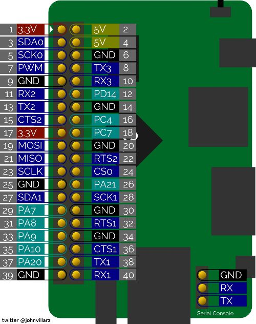
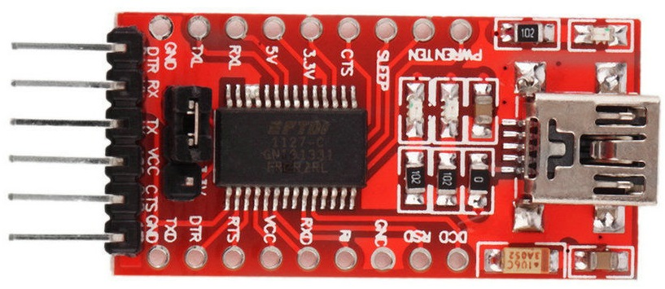

# orange-pi-one-camera

## Creating an SD card for the Orange PI One

Download and unpack the Armbian 5.90 Xenial image with kernel 3.4.113 (This is the last kernel version to contain the required drivers for the Orange PI gc2035 camera)

- https://dl.armbian.com/_old/orangepione/archive/Armbian_5.90_Orangepione_Ubuntu_xenial_default_3.4.113_desktop.7z

Insert the SD card in a reader, etc and use `balenaEtcher` to flash the image

NB. the default login for Armbian images is `root/1234`, then you will be prompted to change the password, etc

## minicom setup

List serial devices with

```
ls /dev/cu.*
```

Could also list `/dev/tty.*` but for this purpose the `cu` devices give exclusive access and is fine. See [this](https://stackoverflow.com/questions/37688257/choosing-between-dev-tty-usbserial-vs-dev-cu-usbserial) stackoverflow answer for the distinction.

Start minicom in setup mode to specify the serial device etc

```
minicom -s
```

Choose `Serial port setup`

- Press `a` to set the `Serial Device` to the correct path then press enter
- Press `e` to set the `Bps/Par/Bits` to `115200 8N1` then press enter
- Press `f` to set `Hardware Flow Control` to `No`
- Press `g` to set `Hardware Flow Control` to `No`
- Press enter to exit `Serial port setup`

Choose `Modem and dialing`

- Delete the strings for settings A - I and K

Choose `Save setup as..`

- Name the config `orange-pi`

Choose `Exit from Minicom`

The to start minicom use the following command

```
minicom orange-pi
```

On MacOS the default meta key is `ESC`, so use `ESC + z` for help (menu) and `ESC + x` to exit

## Wifi setup

The Armbian image we are using does not contain drivers for the mt7601u wireless adapter we are using. These can be installed as follows

```
sudo su -
apt update
apt upgrade
apt install linux-headers-sun8i
cd /usr/src
git clone https://github.com/art567/mt7601usta.git
cd mt7601usta/src
make ARCH=arm
make install
cp RT2870STA.dat  /etc/Wireless/RT2870STA/RT2870STA.dat
modprobe mt7601Usta
```

To add your wireless network to Network Manager

```
nmcli c add type wifi con-name "Wi-Fi connection 1" ifname ra0 ssid YOUR_WIFI_ESSID
nmcli c modify "Wi-Fi connection 1" wifi-sec.key-mgmt wpa-psk wifi-sec.psk YOUR_WIFI_PASSWORD
```

then edit `/etc/network/interfaces` to add the following section

```
auto ra0
iface ra0 inet dhcp
```

lastly reboot to activate everything

```
reboot
```

## Get the camera up and running

Set the correct mode, etc got GPIO pin PG11 and enable the drivers. This has to be done in the correct order so we add the commands to `/etc/rc.local`

```
sudo vim /etc/rc.local
```

and add the following before the `exit 0` statement

```
# enable the CSI connected camera
sunxi-pio -m "PG11<1><0><1><1>"
modprobe gc2035
modprobe vfe_v4l2
```

Install `motion`

```
sudo apt install motion
```

Then edit the `motion` configuration

```
sudo vim /etc/motion/motion.conf
```

and change the following configuration to allow access to the web server from other devices on the network

```
stream_localhost off
```

Also edit the startup script

```
sudo vim /etc/default/motion
```

and change the following setting to enable `motion` on startup

```
start_motion_daemon=yes
```

Then reboot

```
reboot
```

and check the web interface at `http://<address>:8081`

## Connecting with X11 forwarding from MacOS

This build of Armbian includes the X11 stuff so it should be simple to SSH with X11 forwarding. The problem is on the MacOS side as the location of `xauth` from XQuartz is non-standard.

On MacOS ensure that XQuartz is running and that under `Preferences/Security` the `Authenticate connections` option is enabled.

Then add the following line to your `~/.ssh/config`

```
XAuthLocation /opt/X11/bin/xauth
```

It should then be possible to connect with X11 forwarding enabled

```
ssh -X <user>@<opcamera>
```

## Orange PI One pins



## FTDI pins


